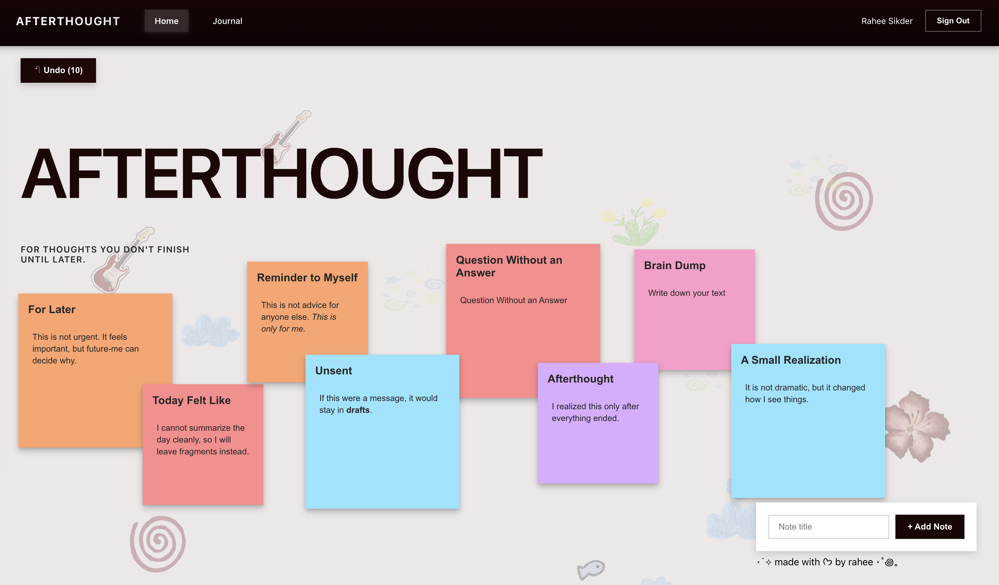
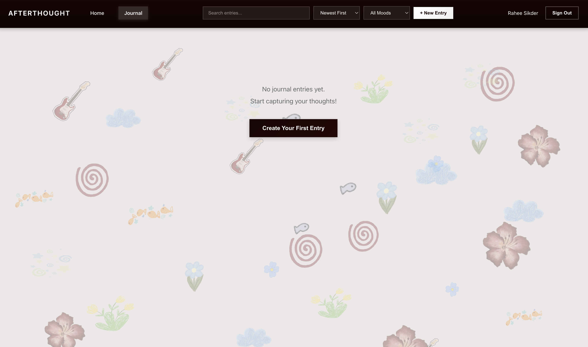

**Afterthought**



A journal (web) application built with React and Firebase. Create draggable notes on an infinite canvas and maintain a personal journal with mood tracking, tags, and markdown support.



Features

Notes
- Create colorful sticky notes with markdown support
- Drag and position notes anywhere on the canvas with grid snapping
- Edit and delete notes with intuitive controls
- Undo last 10 actions (create, edit, delete, move)
- Auto-save to Firebase in real-time

Journal
- Create and manage journal entries with markdown formatting
- Track moods with visual indicators
- Organize entries with tags
- Search, filter, and sort entries
- Date-based timeline view
- Real-time preview while editing
- Auto-save drafts to localStorage

Authentication
- Google OAuth sign-in
- User-specific data storage
- Persistent sessions

Prerequisites

Before you begin, ensure you have the following installed:
- Node.js (v16 or higher)
- npm(v7 or higher)


Setup Instructions

1. clone the Repository
2. `npm install`
3. configure Firebase in `src/services/datastore.js`:
```
const firebaseConfig = {
  apiKey: "YOUR_API_KEY",
  authDomain: "YOUR_AUTH_DOMAIN",
  databaseURL: "YOUR_DATABASE_URL",
  projectId: "YOUR_PROJECT_ID",
  storageBucket: "YOUR_STORAGE_BUCKET",
  messagingSenderId: "YOUR_MESSAGING_SENDER_ID",
  appId: "YOUR_APP_ID",
  measurementId: "YOUR_MEASUREMENT_ID",
}
```

Run with `npm run dev`. The app will open at `http://localhost:5173`

